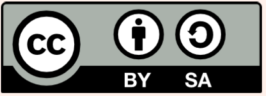
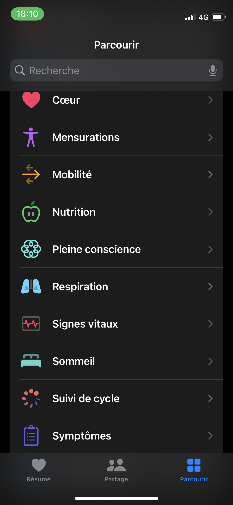
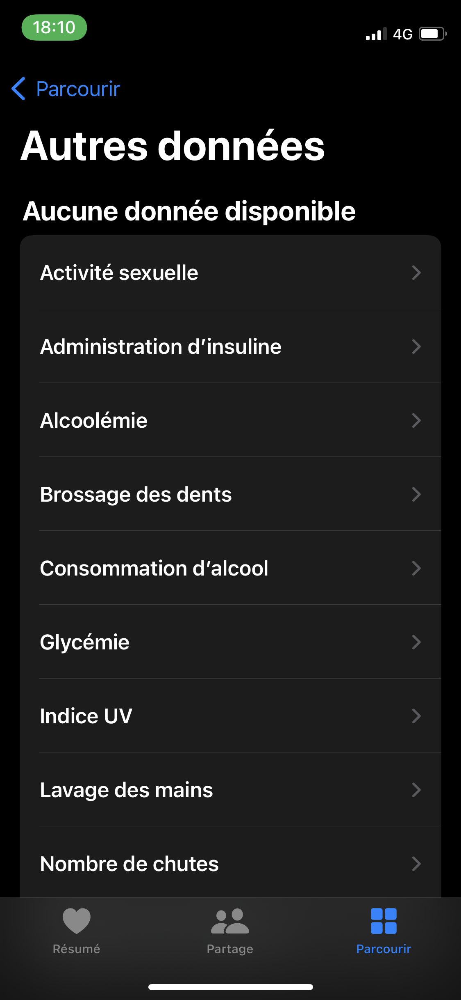
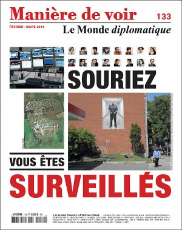
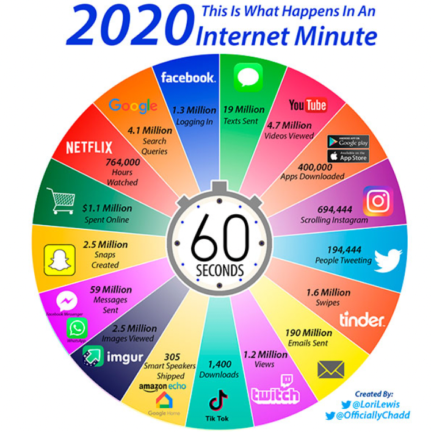
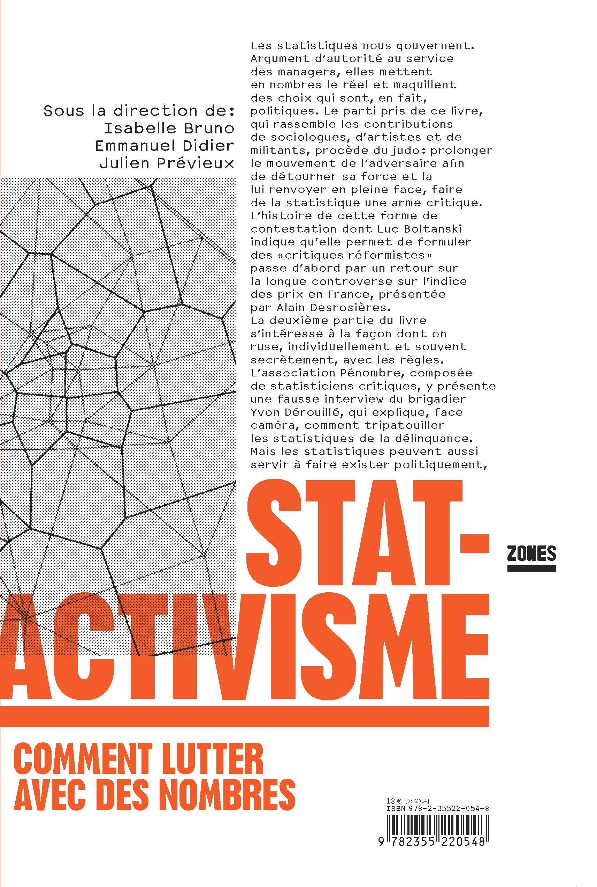
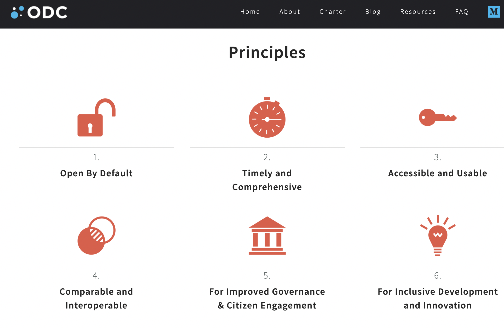

layout: true
  

`r paste0("
", params$event, " 

")` 

---

class: center, middle

Ces slides en ligne : `r paste0("http://datactivist.coop/", params$slug)`

Sources : `r paste0("https://github.com/datactivist/", params$slug)`

Les productions de Datactivist sont librement réutilisables selon les termes de la licence [Creative Commons 4.0 BY-SA](https://creativecommons.org/licenses/by-sa/4.0/legalcode.fr).

 
 

.center[] 

---
class:center, middle, inverse

# 1 - La mise en données du monde
---

### .red[Un exemple pour commencer : ] l'application Santé dans l'iPhone

.left-column[
Cette application qui permet l'échange de données de santé entre applications est installée par défaut sur les iPhone. Elle illustre bien la mise en données de pratiquement tous les aspects de nos vies, regardons le sommaire : ]

.right-column[
.pull-left[
.reduite[]
]
.pull-right[
.reduite[]
]
]

---

###.red["Datafication"] : la mise en données du monde
.left-column[

Kenneth Cukier (2013), “[Mise en données du monde, le déluge numérique](https://www.monde-diplomatique.fr/2013/07/CUKIER/49318)”, _Le Monde Diplomatique_
]
.right-column[
> L'immense gisement de données numériques découle de la capacité à paramétrer des aspects du monde et de la vie humaine qui n'avaient encore jamais été quantifiés. On peut qualifier ce processus de **« mise en données » (datafication)**. 

> La mise en données désigne autre chose que la numérisation, laquelle consiste à traduire un contenu analogique en une séquence de 1 et de 0 lisible par un ordinateur. Elle se réfère à une action bien plus vaste, et aux implications encore insoupçonnées : **numériser non plus des documents, mais tous les aspects de la vie**.
]

---

### La mise en données du monde .red[en une minute]
.center[.reduite[]]
]

---
### Des données sont collectées sur nous à tous les moments de notre vie

.reduite.center[]

---

### La compulsion de laisser des .red[traces]

.left-column[

La thématique de la trace est omniprésente dans _Les Furtifs_ d'Alain Damasio comme ici (p.615) :
]
.right-column[
> La trace ? Empreinte ou marque que laisse le passage d'un être ou d'un objet. Une piste, une brisée, une foulée, un pas ou une passée... Marque laissée par une action quelconque, plus largement. […] 

>Je m'interroge sur la frénésie d'un monde qui ne supporte plus que le présent passe - et passe sans laisser de trace - juste passe. Sur cette compulsion que vous avez  vous et vos affidés, à retenir et à capturer. À piéger dans l'archive, à aspirer sans cesse de la donnée. Sur ce que ça dit de notre inaptitude panique à vivre le présent.

]

---

### Sans .red[traces], dur d'exister, y compris pour les non-humains

_Dirtybiology_ montre dans cet extrait comment les capteurs fixés sur les animaux aident les humains à développer de l'empathie pour eux et à s'impliquer pour leur survie. Mais quid de tous les vivants qui ne seront pas mis en données ?

.center[

<iframe width="560" height="315" src="https://www.youtube-nocookie.com/embed/rwAKMs_54pI?controls=0&amp;start=779" title="YouTube video player" frameborder="0" allow="accelerometer; autoplay; clipboard-write; encrypted-media; gyroscope; picture-in-picture" allowfullscreen></iframe>

]

---

### Difficile aussi de .red[parler politique] sans données

.left-column[
.reduite[]
]

.right-column[
> La numérisation ne serait pas survenue sans une "nombrification" préalable qui consiste à quantifier de plus en plus d'aspects de notre expérience du réel.

> **Au commencement était le verbe, il semble à la fin que tout devient nombre.**

> Personne ne saurait parler sérieusement de l'état de la société et discuter politique sans se référer aux informations quantitatives.
]

---
### _Knowledge is .red[power]_ ?

L'ouverture des données est souvent justifiée par le fait que le savoir serait le pouvoir. Je pense souvent à cet extrait de Game of Thrones où Littlefinger menace la reine Cersei en disant « knowledge is power. » 

.center[<iframe width="560" height="315" src="https://www.youtube-nocookie.com/embed/ab6GyR_5N6c" title="YouTube video player" frameborder="0" allow="accelerometer; autoplay; clipboard-write; encrypted-media; gyroscope; picture-in-picture" allowfullscreen></iframe>]
--
Réduire le pouvoir au savoir, c’est oublier un attribut essentiel de l'exercice du pouvoir, la violence physique légitime (Weber). 

---

### Les données sont .red[un outil de pouvoir]

.left-column[

Le livre [_Data Feminism_](https://mitpress.mit.edu/books/data-feminism) montre l'urgence de ne pas laisser cet outil uniquement entre les mains des puissants. 

]

.right-column[

>_Data feminism is about power—about who has it and who doesn’t. Intersectional feminism examines unequal power. And in our contemporary world, data is power too. Because the power of data is wielded unjustly, it must be challenged and changed._ […]

>_Data is a double-edged sword. In a very real sense, data have been used as a weapon by those in power to consolidate their control._ […]

>_Data are part of the problem, to be sure. But they are also part of the solution. Another central goal of this book is to show how the power of data can be wielded back._
]

---

### Les données peuvent-elles être un .red[contre-pouvoir] ? 

Outil de pouvoir, les données doivent-elles nécessairement rester du côté de celles et ceux qui le détiennent ? Peuvent-elles être aussi un instrument des contre-pouvoirs ? En donnant accès aux fondements de l'information et du savoir, l'ouverture des données pourrait idéalement mettre sur un pied d'égalité l'administration et la société civile et réduire les asymétries d'information. 

.left-column[

]

.right-column[
_Les statistiques nous gouvernent. Argument d’autorité au service des managers, elles mettent en nombres le réel et maquillent des choix qui sont, en fait, politiques. Le parti pris de ce livre, qui rassemble les contributions de sociologues, d’artistes et de militants, procède du judo : prolonger le mouvement de l’adversaire afin de détourner sa force et la lui renvoyer en pleine face, faire de la statistique une arme critique._ 

]
---
### Les principes de l'.red[open data]

Petit rappel : depuis 2007, l'ouverture des données promet une mise à disposition des données par défaut, dès que possible, de manière exploitable et interopérable, afin d'améliorer la gouvernance et de créer une innovation plus inclusive. 

.reduite.center]

---
class:inverse,middle,center

# .red[Chantier 1]
## Obtenir les données qui manquent

---
### Refonder le .red[droit d'accès]

* Transférer les compétences en matière de transparence de la CADA vers la Haute Autorité pour la Transparence de la Vie Publique (HATVP) 

* Transférer à la CNIL l’arbitrage de l’accès aux données individuelles traitées par les acteurs publics 

* Créer un point central pour les demandes d’accès avec des interlocuteurs désignés

* Donner à la HATVP le pouvoir de sanctionner les administrations systématiquement récalcitrantes

* Créer un « référé communication » pour accélérer le traitement des demandes

---

### Produire des données d’intérêt général

* Renforcer le cadre légal des données d’intérêt général

* Créer des coopératives de données

* Développer le crowdsourcing de données publiques

--

### Développer la concertation entre producteurs et réutilisateurs

* Créer un conseil national de la donnée

* Étendre et renforcer le service public de la donnée

* Créer des plans nationaux d’ouverture sectorielle

---
class:inverse,middle,center

# .red[Chantier 2]
## Améliorer la qualité et la fiabilité des données ouvertes
---
### Pérenniser l’ouverture

* Archiver les données publiques

* Fédérer producteurs et réutilisateurs de données autour d’une organisation d’intérêt général

* Relancer l’administrateur général des données

--

### Créer des incitations à l’amélioration des données

* Faire remonter la destination des données

* Faire entrer l’ouverture des données dans les fiches de poste des agents

* Montrer les résultats

* Citer les agents

---
class:inverse,middle,center

# .red[Chantier 3]
## Développer la culture des données

---
### Placer les données au coeur des politiques publiques

* Généraliser les stratégies data

* Co-construire des politiques publiques “nativement” avec les données

* Co-construire les indicateurs des politiques publique

* Développer le sourcing des réutilisateurs

--

### Développer une culture critique des données

* Systématiser l’ouverture et usage des données dans les concertations

* Développer les programmes qui apportent un regard critique sur les données

* Développer la factualité

---

### Former massivement aux données 

* Développer les Infolabs

* Inviter les données ouvertes dans les médiathèques

* Intégrer les données dans les programmes scolaires

---
class: inverse, center, middle
# Merci !

Contact : [samuel@datactivist.coop](mailto:samuel@datactivist.coop)
