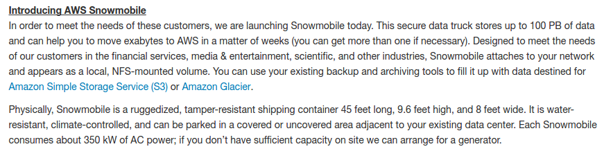
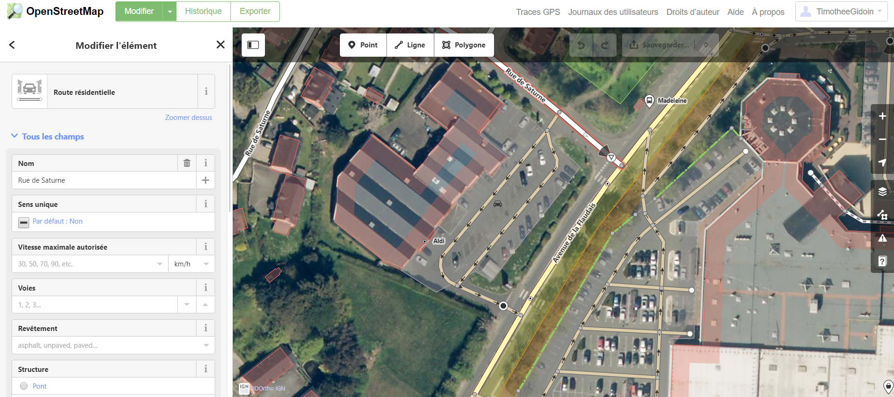
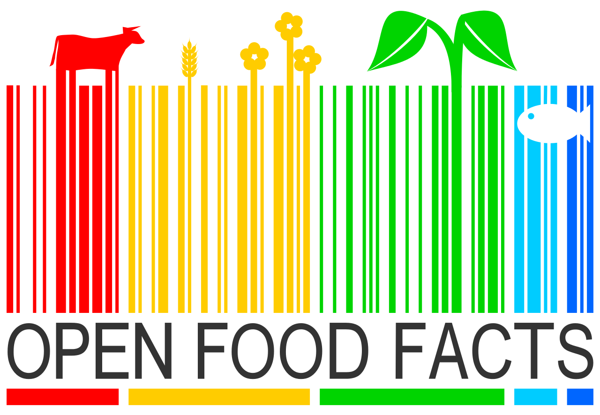
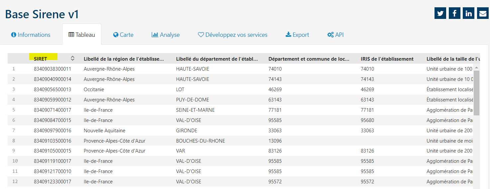

layout: true
  

`r paste0("
", params$event, " 

")` 

---

class: center, middle

Ces slides en ligne : `r paste0("http://datactivist.coop/", params$slug)`

Sources : `r paste0("https://github.com/datactivist/", params$slug)`

Les productions de Datactivist sont librement réutilisables selon les termes de la licence [Creative Commons 4.0 BY-SA](https://creativecommons.org/licenses/by-sa/4.0/legalcode.fr).

 
 

.center[] 

---
class:center, middle, inverse

# 1 - Au fait, c'est quoi une donnée ?
---

## Introduction 

[Interview de Serge Abiteboul](https://www.youtube.com/watch?v=qqvsiTUJy7k), commissaire scientifique de l'[exposition Terradata](https://www.cite-sciences.fr/fr/ressources/expositions-passees/terra-data/) et directeur de recherche à l'Inria :

.center[
<iframe width="560" height="315" src="https://www.youtube.com/embed/qqvsiTUJy7k" frameborder="0" allow="accelerometer; autoplay; encrypted-media; gyroscope; picture-in-picture" allowfullscreen></iframe>
]

---
Classe: middle

## Une définition des données

.pull-left[

]
 
.pull-right[
 
> *Les données sont couramment comprises comme les matériaux bruts produits dans l’abstraction du monde en catégories, mesures et toute autre forme de représentation-nombres, caractères, symboles, images, sons, ondes électromagnétiques, bits qui constituent les fondations sur lesquelles l’information et le savoir sont créés.*
]

---

## Les données sont partout !

.center[]

#### Identifiez 3 appareils qui collectent des données 

.footnote[source : [The Economist](http://lazowska.cs.washington.edu/escience/Economist.big.data.pdf)]

---

### La pyramide Data-Information-Knowledge-Wisdom

Attribuée à [Russell Ackoff](http://en.wikipedia.org/wiki/Russell_L._Ackoff) en 1989, elle signfie que :
.pull-left[

]

.pull-right[

- Les **.red[données]** sont la matière "brute" de l'information conçues plutôt pour des machines.
- **.red[L'information]** pourrait être définie comme des données qui ont été interprétées pour dégager du sens pour des humains.
- En donnant du sens à de l'information, on obtient de la **.red[connaissance]**
- En donnant du sens à la connaissance on obtient de la **.red[sagesse]**.]

---
Class:
## La pyramide Data-Information-Knowledge-Wisdom

.center[]

_NB : le haut de la pyramide, est parfois remplacé par "compétence"_

---

### Les données, la base de l'informatique

La naissance de l'informatique est le point de départ d'un déluge de données. Tout ce qui circule dans un ordinateur, ce sont des données. Elles sont la base de l'informatique.

.pull-left[]
.pull-right[
Pensez à votre abonnement téléphonique, chaque mois, vous payez pour consommer un certain volume de données quantifié en octet ou en bit. 

Le volume des données créées et traitées ne cesse de croitre en même temps que les capacités de calcul et de stockage des ordinateurs. 
]

---
### L'augmentation des capacités de calcul et de traitement 

---

### L'augmentation des capacités de calcul et de traitement 

---

---
### Dans les grands modèles de langage, les données mais plus encore la taille des modèles sont déterminants

---

GPT-3, le grand modèle de langage (large language model, LLM) créé par OpenAI en 2020 compte 175 milliards de paramètres (entraîné sur un corpus de 570GB de données, soit 500 milliards de *tokens*). S'il avait été entraîné sur une seule carte GPU, [cela aurait pris 288 ans](https://arxiv.org/pdf/2104.04473.pdf) !  Le coût pour entraîner (une fois) le modèle est estimé à quelque part entre 4,6M$ et 46M$. 

GPT-4 devrait compter un ordre de grandeur en plus de paramètres.  

On parallélise les GPUs mais même cela a ses limites. Même générer une prédiction à partir de ces modèles (i.e. interroger ChatGPT) est très coûteux en ressources de calcul ! 

Pour approfondir : https://techmonitor.ai/technology/ai-and-automation/chatgpt-ai-compute-power

---
class:center, middle, inverse

# 2 - L'industrialisation de la production des données

---

### La tablette mésopotanienne : inscrire une réalité complexe
Vers 3200 av. J.-C., en Mésopotamie, la civilisation sumérienne a inventé l’écriture d'abord pour mémoriser des comptes.

.pull-left[

]

.pull-right[
>Arbres et têtes de bétails sont classés pour être comptabilisés. On a bien affaire ici à des données.
]
---

### La carte perforée (1884) : le début de la massification des données

Apparue au départ dans les métiers à tisser, les carte perforées contiennent des informations représentées par la présence ou l'absence de trous dans une position donnée.

.pull-left[
.middle[]
]
.pull-right[
Elles sont les premières mémoires de masse utilisées dans l'informatique au XIXe siècle.

En 1884, Herman Hollerith a déposé un brevet pour une machine à cartes perforées destinée à accélérer la production de statistiques pour les gouvernements. Deux ans plus tard, il crée IBM le géant de l'informatique.  
]

.footnote[Vidéo de l'INA : [La carte perforée](https://m.ina.fr/video/CAF97059686/la-carte-perforee-video.html)]
---

### Les bases de données relationnelles (1970)

Dans les bases de données relationnelles, les données sont inscrites dans des tables et reliées entre elles par un schéma et des identifiants uniques. Cela permet de traiter de plus grands volumes, de développer des données plus complexes et d'éviter des erreurs de saisie.

.pull-left[
]

.pull-right[
Les bases de données relationnelles facilitent grandement le traitement des données puisqu'elles sont accessibles à travers une interface utilisateur : « il faut protéger les futurs usagers de grandes banques de données d’avoir à connaître comment les données sont organisées dans la machine » (Codd 1970).
]

---
### Le tableur (1979) : *data to the people*

En 1979, Dan Bricklin, un ancien analyste financier exaspéré par les techniques de calcul encore manuelles, a imaginé une technique de calcul visible (« *Visible Calculator* »). 

Son logiciel "Visicalc", .red[démocratise la production des données] en proposant le système de la feuille de calcul sur laquelle les données peuvent être directement manipulées : 

> "La facilité d’utilisation de Visicalc provenait du fait que l’utilisateur n’avait pas besoin de connaitre de langage de programmation. Sur cet aspect, Visicalc était **l’équivalent du traitement de texte** dans lequel un utilisateur arrange directement l’impression de la page, à l’opposé des systèmes d’écriture où l’utilisateur devait inscrire un ensemble d’inscriptions pour mettre en page le texte." ([Campbell-Kelly, 2007](http://www.oxfordscholarship.com/view/10.1093/acprof:oso/9780198508410.001.0001/acprof-9780198508410))

---

### Le tableur (1979) : *data to the people*

.center[ Dan Bricklin et Bob Frankston ont inventé le tableur, le premier logiciel de calcul de masse. Découvrez en 5 minutes leur invention : 

<iframe width="560" height="315" src="https://www.youtube.com/embed/2a5ex5QlocQ" frameborder="0" allow="accelerometer; autoplay; encrypted-media; gyroscope; picture-in-picture" allowfullscreen></iframe>
]

---
class:center, middle, inverse

# 3 - La fin des sciences ?
---

## Le déluge des données
La réflexion autour de la fin de la science part du constat de l'explosion de la production de données comme l'illustre cette infographie sur les réseaux sociaux en une minute. 
.pull-left[
> "Avec suffisamment de données, les chiffres parlent d’eux-mêmes." 
> Chris Anderson, journaliste *Wired Magazine*

.footnote[[Consulter la source](http://internetactu.blog.lemonde.fr/2011/09/30/big-data-est-ce-que-le-deluge-de-donnees-va-rendre-la-methode-scientifique-obsolete/)]
]
.pull-right[
.reduite.center[
]
]

---

## De plus en plus de données

 |  | 

En deux jours, l’humanité produit autant d'information que ce qu'elle a produit depuis la naissance de l'écriture jusqu’en 2003.

---

### C'est nouveau ce déluge ?

.pull-left[
> *"Les perceptions d'une "surabondance informationnelle" (ou d'un "déluge de données") ont émergé de manière répétée depuis la Renaissance jusqu'aux périodes modernes et, à chaque fois, des technologies spécifiques ont été inventées pour gérer la surabondance perçue."*

Strasser, B. J. (2012). "[Data-driven sciences: From wonder cabinets to electronic databases""](http://biologie.unige.ch/assets/brunostrasser//Strasser_SHPSSB_2012.pdf)
]

.pull-right[.reduite[]]

---

### La méthode scientifique est-elle obsolète ? 

Les sciences sont traversées par la promesse d’un **.red[quatrième paradigme scientifique]**. Il suffirait alors d'**explorer les données pour .red[identifier des corrélations]** (une relation entre des phénomènes) et de **comprendre la causalité.** 

> Le déluge des données rend la méthode scientifique obsolète, l’analyse des motifs et des relations contenues dans les données massives produit intrinsèquement un savoir significatif et éclairé sur des phénomènes complexes. Il y a maintenant une meilleure manière de faire. Les petabytes nous permettent de dire que « la corrélation suffit ». Nous pouvons analyser les données sans hypothèses sur ce qu’elles peuvent montrer.

> Anderson, C. (2008) "[The end of theory: The data deluge makes the scientific method obsolete](https://www.wired.com/2008/06/pb-theory/)", *Wired*

---

### Le risque : confondre corrélation et causalité

Deux événements (appelons les X et Y) sont corrélés si l’on observe une relation entre les deux. Une erreur de raisonnement courante consiste à dire : « X et Y sont corrélés, donc X cause Y ». On .red[confond corrélation et causalité].

**_L'effet cigogne_** désigne la tendance à confondre corrélation et causalité.

.pull-left[]

.pull-right["Dans les communes qui abritent des cigognes, le taux de natalité est plus élevé que dans l’ensemble du pays. Conclusion : les cigognes apportent les bébés ! En fait, les cigognes nichent de préférence dans les villages où la natalité est plus forte en milieu rural que dans les villes."
]

.footnote[Source : [cortecs.org](https://cortecs.org/materiel/effets-cigogne-correlation-vs-causalite/)]

---

## Vous aussi, générez des corrélations absurdes

.center[
L'équipe des Décodeurs du *Monde* a produit un [générateur de comparaisons absurdes et parfois drôles](https://www.lemonde.fr/les-decodeurs/article/2019/01/02/correlation-ou-causalite-brillez-en-societe-avec-notre-generateur-aleatoire-de-comparaisons-absurdes_5404286_4355770.html), essayez le !

]

---

### Le déluge des données à l'épreuve des sciences sociales

Les sciences sociales n’échappent pas à la montée en puissance de la *data driven science*. Le *social computing* désigne une branche de l'informatique qui essaie de comprendre les comportements sociaux par l'analyse de données et l'usage d'outils informatiques. 

Lev Manovich ([2011](http://manovich.net/content/04-projects/067-trending-the-promises-and-the-challenges-of-big-social-data/64-article-2011.pdf)) signale que **cette approche comporte plusieurs risques** : 
* elle favorise les chercheurs ayant des liens officiels avec les industriels des réseaux sociaux qui vont fournir les données (difficile alors de les critiquer) ; 
* des évidences pour les sciences humaines vont être présentées comme nouvelles ; 
* à l'inverse, certains enseignements majeurs de la littérature des sciences humaines sont ignorés ; 
* les traces numériques des réseaux sociaux sont perçues comme authentiques ignorant les multiples stratégies de gestion des identités des individus ;
* ces recherches disposent d'une force rhétorique bien supérieure en s'appuyant sur les données de plusieurs millions d’individus. 

---

### Une nouvelle ère dans la construction du savoir ?

L'abondance des données amène à un renouvellement des techniques, ouvre de nouveaux champs d'études et remet parfois en cause des savoirs que l'on pensait acquis. 

.pull-left[
]

.pull-right[
> *L'indexation collaborative des fiches des soldats Morts pour la France sur le site Mémoire Des Hommes a permis de révéler que [le jour le plus meurtrier de la Première Guerre mondiale pour les Français n'était pas le 22 août 1914](https://www.opex360.com/2018/05/05/selon-site-memoire-hommes-25-septembre-1915-aurait-ete-jour-plus-meurtrier-de-lhistoire-de-larmee-francaise/).*

[Mémoire des hommes](https://www.memoiredeshommes.sga.defense.gouv.fr/)]

---

class: inverse, center, middle

# 4. Données et multitude
---

## Données et multitudes 

Verdier et Colin (2015) ont théorisé "l'âge de la multitude" : à l'ère de la révolution numérique,
la multitude (c'est-à-dire : nous) représente une source de richesse potentielle massive. Notamment parce que cette multitude produit, volontairement ou pas, beaucoup de données...

.center[.reduite[]]

---

## Les données crowdsourcées

Des données produites par un grand nombre de personnes, de manière décentralisée ; des communs partagés et gouvernés par leurs producteurs.

Concrètement, les données sont issues du travail collaboratif de divers acteurs, bénévoles (ou pas), dans la récolte sur le terrain.

**Connaissez-vous un site ou une application fonctionnant via des données crowdsourcées ?**

--

.pull-left[Exemple : OpenStreetMap, le wiki de la carte]

.pull-right[
.reduite[]
]

---
## Exemple 1 : OpenStreetMap

> **Pourquoi faites-vous OpenStreetMap ?** 
> 
> Les données géographiques (géo-données) ne sont pas libres dans nombre de régions du monde, par exemple en France, en Belgique, au Canada. En général, ces régions ont confié la tâche de cartographie à diverses agences gouvernementales, qui en retour font de l'argent en revendant les données à des gens comme vous et moi. Si vous vivez dans un de ces pays, alors vos impôts servent à payer le travail de cartographie. 

> En France certaines données du ministère des finances (données cadastrales pour l'identification des parcelles) peuvent être réutilisées comme référence, mais avec des conditions qui ne permettent pas une exploitation massive permettant d'obtenir une carte complète (leur précision ne permet pas nécessairement d'identifier tous les chemins, rues et routes qui traversent une même parcelle ; de plus elles ne sont souvent plus à jour).

.footnote[ Source : [La FAQ d'OpenStreetMap](https://wiki.openstreetmap.org/wiki/FR:FAQ#Pourquoi_n.27utilisez_vous_pas_Google_Maps_ou_untel_pour_vos_donn.C3.A9es_.3F)]

---
## Exemple 1 : OpenStreetMap

En résumé :

+ OpenStreetMap (OSM) est un projet de cartographie qui a pour but de constituer une base de données géographiques libre du monde (permettant par exemple de créer des cartes sous licence libre), en utilisant le système GPS et d'autres données libres.

+ À la manière de Wikipédia, **tous les internautes naviguant sur le web peuvent contribuer à la création et à la numérisation de cartes**. Des éditeurs permettent de réaliser en ligne des cartes en se basant sur un fond d'image satellitaire. Cependant, ces images satellitaires ne couvrent pas toujours en haute résolution l'ensemble du globe. C'est pourquoi il est possible d'introduire des données provenant de récepteurs GPS. Il suffit pour cela de réaliser un itinéraire et de positionner le récepteur en mode enregistrement, puis de le restituer sur le serveur de données d'OpenStreetMap.  

---
## Exemple 1 : OpenStreetMap

Vous aussi vous pouvez contribuer à OpenStreetMap !

.center[] 

---
## Exemple 2 : OpenFoodFacts

.center[] 

> Open Food Facts est une base de données sur les produits alimentaires faite par tout le monde, pour tout le monde. Elle vous permet de faire des choix plus informés, et comme les données sont ouvertes (open data), tout le monde peut les utiliser pour tout usage.

> Open Food Facts est un projet citoyen à but non lucratif créé par des milliers de volontaires à travers le monde. Vous pouvez commencer à contribuer en ajoutant un produit de votre cuisine, et nous avons plein de projets enthousiasmants auxquels vous pouvez participer de beaucoup de façons différentes.

---
## Exemple 2 : OpenFoodFacts

Vous aussi vous pouvez contribuer à OpenFoodFacts !

.center[]

---
## Exemple 2 : OpenFoodFacts  

Et vous connaissez très probablement une application qui utilise (ou a utilisé) les données d'OpenFoodFacts pour "évaluer" la composition des produits alimentaires...

--

**Yuka** ! Avec plus de 25 millions d'utilisateurs fin 2021, elle a désormais un impact non négligeable, y compris dans la stratégie des grandes marques de l'agroalimentaire..

.center[]

---
## La Grande Annotation 

**L'objectif ?** Faire en sorte que les contributions au grand débat puissent être lues et comprises. Tout un chacun peut, sur le site [grandeannotation.fr](https://grandeannotation.fr/) lire ces textes, classés par thème et par question, et les annoter pour en révéler le sens.

.center[]

Plutôt que d'obtenir une synthèse des contributions au grand débat qui soit non collaborative, opaque (car réalisée par quelques sociétés) et en partie traitée par de l'intelligence artificielle, la Grande Annotation veut construire une synthèse collective, transparente et fondée sur l'intelligence humaine.

---
## La Grande Annotation 

**Vous aussi vous pouvez contribuer en annotant les réponses au grand débat !**
Ce faisant, vous créez de fait de nouvelles données qui viennent qualifier et enrichir les données initiales.

.center[]
---
class: inverse, center, middle

## 3. Petit lexique autour des données 

---

##Index (ou identifiant unique)

**Index** : Des données permettent l'identification et la mise en relation. Essentielles pour enrichir les données. Exemple : le numéro de SIRET dans la base Sirene (informations concernant les entreprises et les établissements immatriculés au répertoire interadministratif Sirene depuis sa création en 1973), gérée par l'Insee

.center[]

---

## Attributs

**Attributs** : Des données représentent les aspects d'un phénomène, mais ne sont pas des index (pas identifiants uniques). Exemples avec la base Sirene : région de l'établissement, département de l'établissement, Iris de l'établissement...

.center[]

---

## Métadonnées 

**Métadonnées** : Des données sur les données. Peuvent être descriptives, structurelles ou administratives. Exemple de standard : le [Dublin Core](https://fr.wikipedia.org/wiki/Dublin_Core). 

Pour notre exemple précédent, les métadonnées (date de modification, producteur, nombre de téléchargements, thématiques...) sont les suivantes :

.center[]

---

### Et pour vous, c'est quoi les données ? Quels sont vos enjeux ? 

---
class: inverse, center, middle
# Merci !

Contact : [joel@datactivist.coop](mailto:joel@datactivist.coop)
