layout: true
  

`r paste0("
", params$event, " 

")` 

---

class: center, middle

Ces slides en ligne : `r paste0("http://datactivist.coop/", params$slug)`

Sources : `r paste0("https://github.com/datactivist/", params$slug)`

Les productions de Datactivist sont librement réutilisables selon les termes de la licence [Creative Commons 4.0 BY-SA](https://creativecommons.org/licenses/by-sa/4.0/legalcode.fr).

 
 

.center[] 

---

### DoMeSCO: Données et Médiation Scientifique durant la Covid-19

.pull-left[
.red[Contexte : Covid-19, importance accrue des données dans la démocratie scientifique et technique]

- Communication gouvernementale d'urgence
- Initiatives de médiation autour des données

.red[En France : succès de la médiation scientifique spécialisée]

- Rôle moteur dans l'ouverture des données
- Tiers de confiance pour les pouvoirs publics
- Collaboration inédite avec l'administration
]

--
.pull-right[
.red[Objectifs du projet]

- Diffuser les enseignements tirés de cette période
- Outiller les actions de médiation futures
- Guider les modalités de production et d’ouverture des données au sein de l’administration publique

.red[Partenaires et soutien]
- Mines ParisTech (CSI)
- Datactivist
- Café des sciences
- Direction Interministérielle de la Transformation Publique
]
---
### La médiation scientifique et les données : que dit la littérature ?

.red[Approches critiques sur la pandémie data driven]

- Pollution cognitive et infodémie
- Sociologie de la quantification : effets de cadrage et data gaps (pauvreté, inégalités…)

.red[Médiation réflexive et initiatives de visualisation]

- Diversité des formes et des objectifs
- Précautions et capacités critiques

.red[Comprendre les dynamiques de médiation]

- Repenser les questions de "post-vérité" et "fausses informations"
- Médiation scientifique dans le développement d'une culture de la donnée

---
class:center, middle, inverse

# 1 - Retour sur l'ouverture des données covid

## Un moment charnière pour l'open data 

---
### On peut débattre de tout… sauf des chiffres ?

.center[<iframe width="560" height="315" src="https://www.youtube.com/embed/uUZDWW7V36A" title="YouTube video player" frameborder="0" allow="accelerometer; autoplay; clipboard-write; encrypted-media; gyroscope; picture-in-picture" allowfullscreen></iframe>]

---

### Les données de veille sanitaire : un objet politique

.pull-left[

* **Focus sur les données de veille sanitaire** : contaminations, entrées à l’hôpital, passages en réanimation, décès, tests, injections de vaccins, état des stocks, part des variants, en passant par les taux d’incidence et de positivité, le niveau du R0

* Une petite partie du vaste paysage de données sur la Covid-19

* Une mise à l'épreuve du principe d'open data par défaut (loi pour une République numérique

]

.pull-right[

>« Toutes les mesures politiques, tous nos discours, toutes nos réflexions sont orientées et conformées, à un degré rarement atteint, par des outils quantitatifs. »

Emmanuel Didier, "[Politique du nombre de morts](https://aoc.media/opinion/2020/04/15/politique-du-nombre-de-morts/)", _AOC_, 16 avril 2020

]

---

### 11 janvier 2020 : une pandémie instantanément mise en données

.pull-left[

[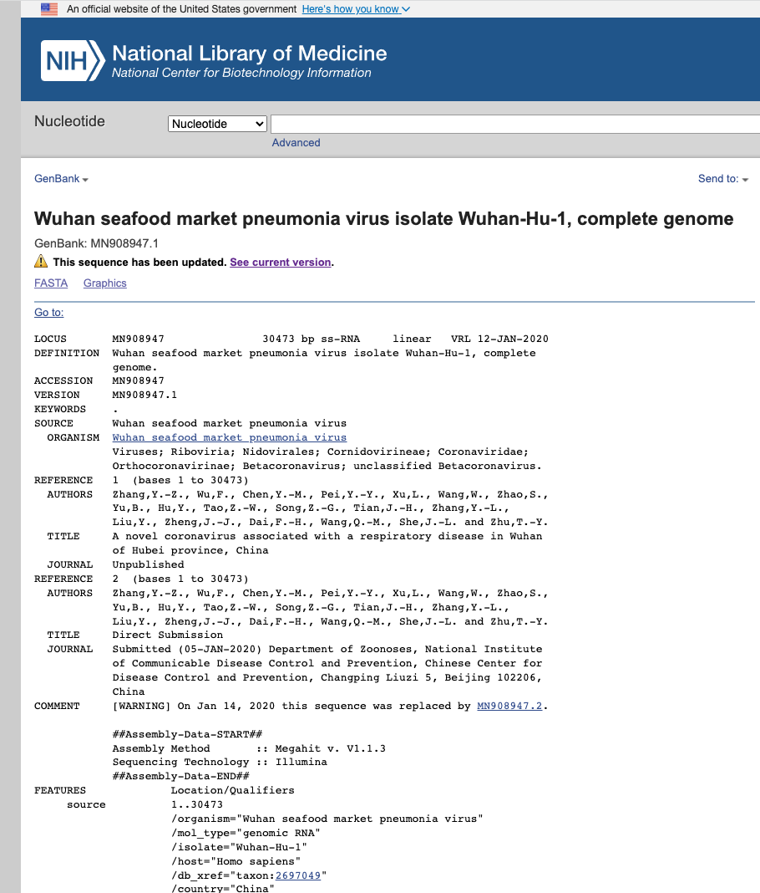](https://www.ncbi.nlm.nih.gov/nuccore/MN908947.1)

]

.pull-right[
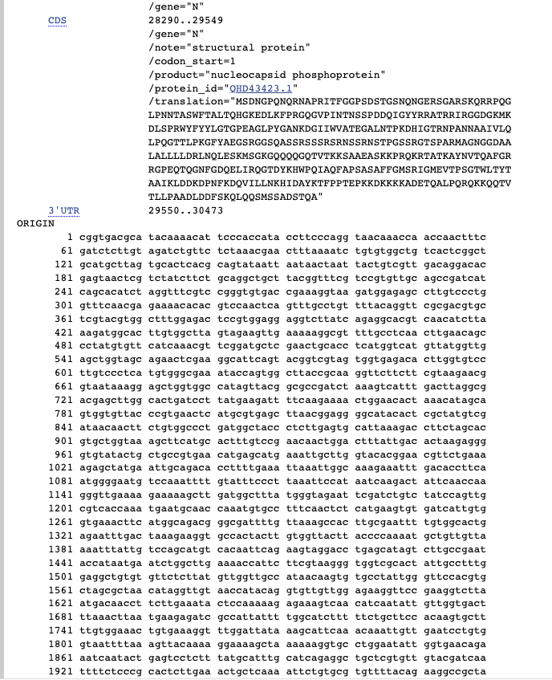
]

---

### Juste après la publication du génôme : la course aux vaccins

.pull-left[

]

.pull-right[

> « Au petit matin, toujours en pyjama dans ma chambre, je me suis collée devant mon ordinateur pour développer un vaccin. » 

 Teresa Lambe (Oxford University) dans le documentaire "La Course aux vaccins" de la BBC diffusé sur Arte

]
---

### Juste après la publication du génôme : les tests PCR

.pull-left[

]

.pull-right[
Le **13 janvier 2020**, sur la base de ces données, une équipe de recherches allemande crée le premier test PCR de dépistage de la Covid-19. 
]

---

### L'émergence des tableaux de bord de suivi de la pandémie

.reduite.center[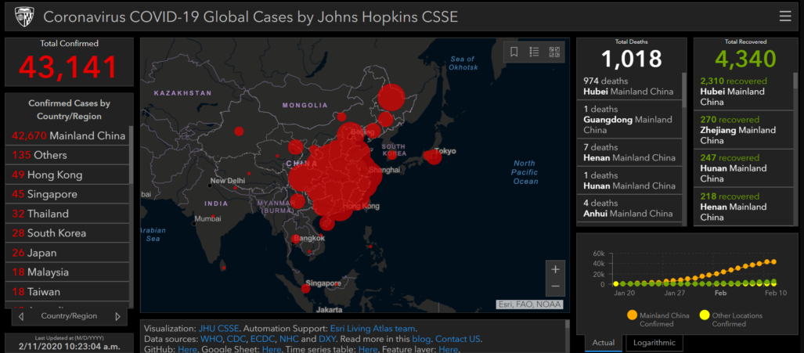]

Publié le 21 janvier 2020 par Ensheng Dong, doctorant à l’école d’ingénieur de l’université Johns Hopkins, le tableau de bord de l'université Johns Hopkins a attiré en quelques semaines plusieurs millions de visiteurs.

---

### L'inconnu du nombre de cas

.pull-left[
.reduite.center[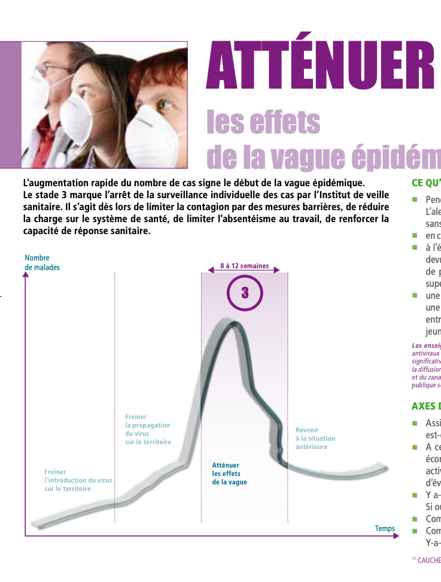]

]

.pull-right[
Extrait du [plan pandémie grippale de 2011](https://solidarites-sante.gouv.fr/IMG/pdf/Plan_Pandemie_Grippale_2011.pdf) : 
>"L’augmentation rapide du nombre de cas signe le début de la vague épidémique.
Le stade 3 marque l’arrêt de la surveillance individuelle des cas par l’Institut de veille
sanitaire."

]
Avertissement de Santé Publique France en mars 2020 : « _du fait de la difficulté de l'identification et de la confirmation biologique de l'ensemble des cas de Covid-19, les données présentées sous-estiment le nombre réel de cas._"

---

### Remonter les données : un défi inédit
.pull-left[
Les EHPAD
[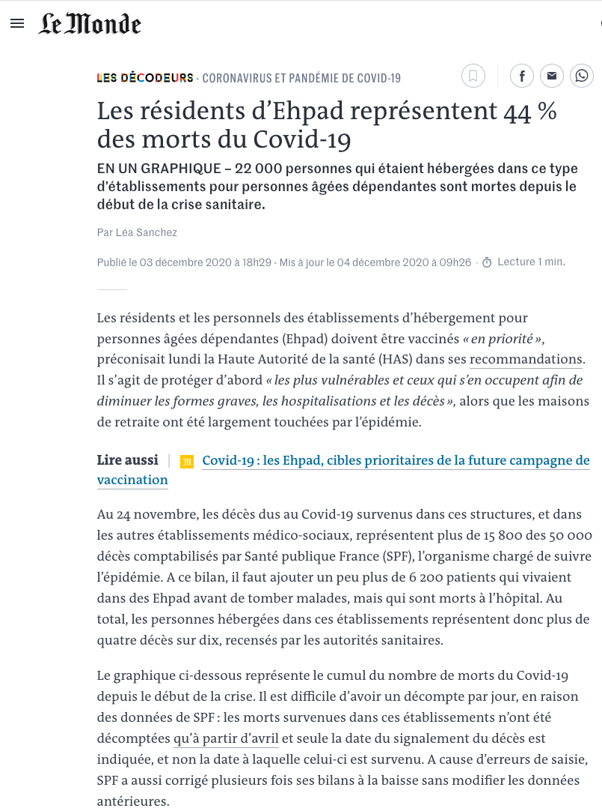](https://www.lemonde.fr/les-decodeurs/article/2020/12/03/les-residents-d-ehpad-representent-44-des-morts-du-covid-19_6062084_4355770.html)
]

.pull-right[
Le nombre de tests

]

---

### L'ouverture des données : une apparition tardive

.pull-left[
[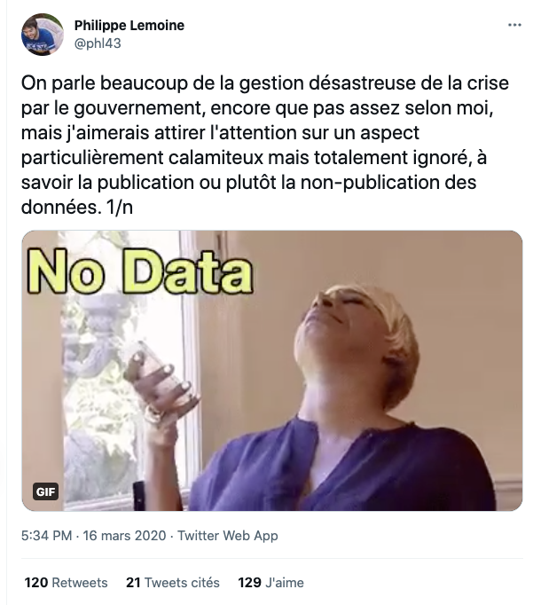](https://twitter.com/phl43/status/1239590836947517442)

]

.pull-right[

]

---

### Une initiative citoyenne pour collecter et ouvrir les données sur la pandémie

.pull-left[
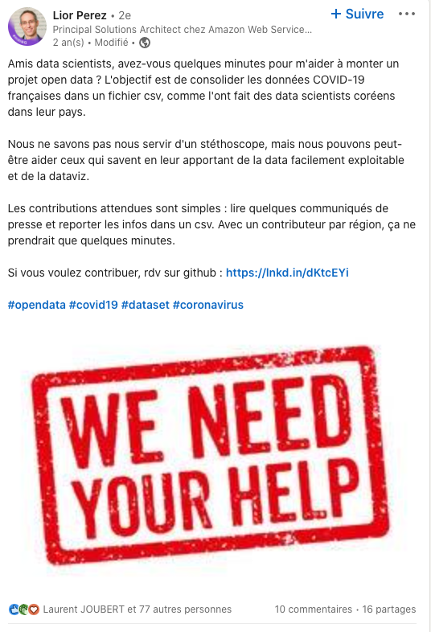
]

.pull-right[
[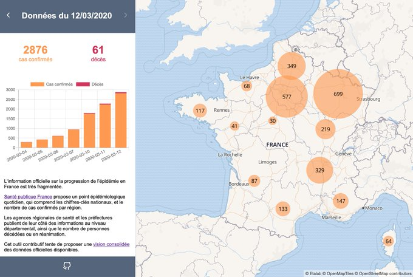](https://twitter.com/jdesboeufs/status/1238527335109931010)
]

---

### Fin mars 2020 : ouverture des données de Santé Publique France 

.pull-left[
_« Le libre accès aux données relatives à l’épidémie, ce qu’on appelle l’open data, assure la confiance des citoyens dans les éléments qui leur sont communiqués, favorise les actions de prévention contre la propagation du virus et facilite la prise de décision.
La diffusion et l’exploitation de ces données ont été rendues possibles grâce à une collaboration étroite entre plusieurs administrations et la société civile.»_

J. Salomon, directeur national de la santé, point presse coronavirus du 28 mars 2020

]

.pull-right[
[
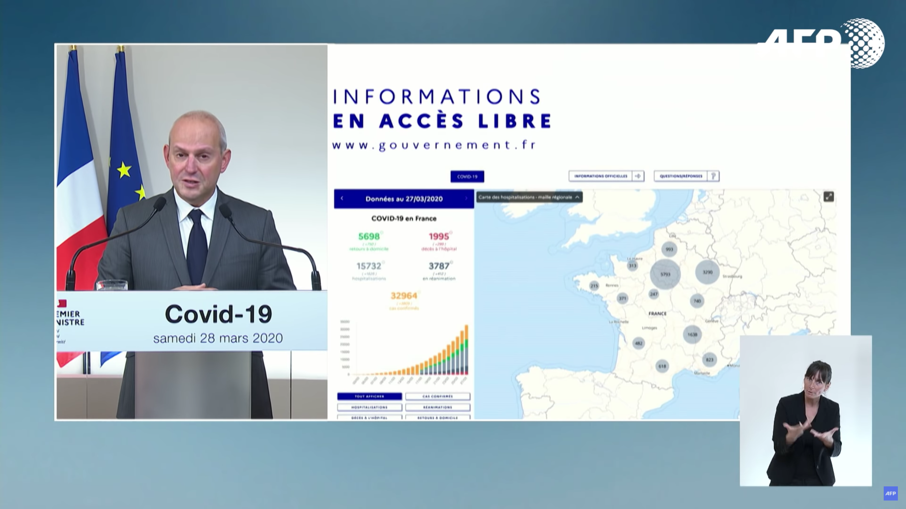](https://www.youtube.com/watch?v=dXvObKQ24ps)

]

---
### Des données très scrutées pour prévoir les déconfinements successifs

---

### Des données très utilisées par le public

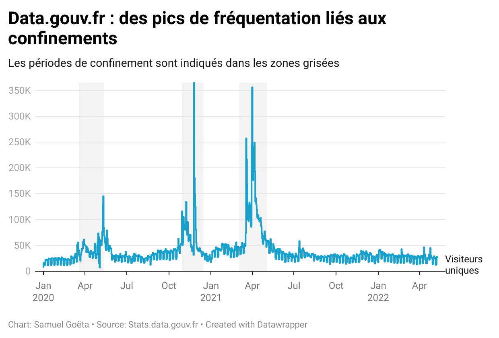

---

### Une relance de la politique d'open data en France

.pull-left[

]

.pull-right[
Au terme de six mois d’auditions et de concertation, le député Bothorel a rendu son rapport au Premier ministre le 23 décembre 2020. 

Le rapport a abouti à une circulaire le 28 avril 2021 par le Premier ministre imposant notamment la nomination d’un administrateur des données, des algorithmes et des codes sources (AMDAC) dans chaque ministère.

Chaque AMDAC a ensuite publié une feuille de route sur la donnée.

]

---

### L'émergence des médiateurs de données

---

### Des demandes d'ouverture de données portées par les médiateurs

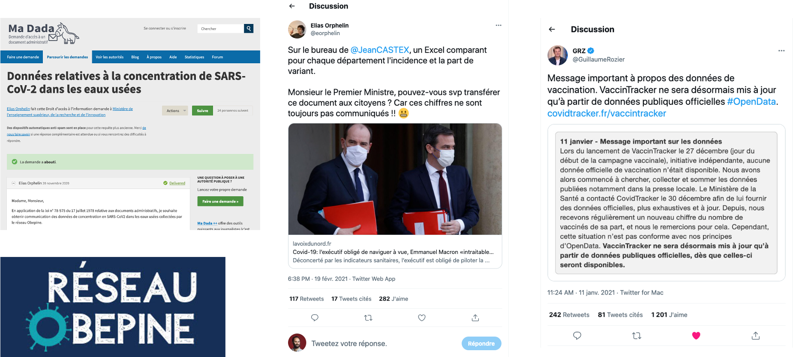

---

### Le hackathon Covid  : comment rassembler société civile et administration ?

---
### Un accélérateur né de la pandémie

    

---

### Thèmes : les multiples dimensions du travail de médiateur de données 

.red[Le travail infrastructurel]

- interfaçage avec des SI différents et changeants
- gestion de la montée en charge
- outils d’automatisation

.red[Le travail des données]

- production / reproduction
- curation dans un paysage mouvant
- sanity checks
- nettoyage / reformattage

.red[le travail de publication]
- politiques de visualisation
- design
- réflexivité et précautions

---

### …mais aussi

.red[Le travail politique]
- les demandes d’ouverture des données
- constitution d’un collectif

.red[le travail organisationnel]
- en interne
- avec l’administration
- dans l'administration

--> ni manichéisme, ni angélisme

--> repenser les frontières de la médiation

---
### Hors champs

.red[les médiations de données ‘défiantes’]
… qui interroge la posture ‘apolitique’ des médiateurs ?

.red[l’implication des patients]

… une absence qui rejoue sur les données la question de l’expertise scientifique 

.red[les modélisations]

… qui illustre la place qui est faite aux données

---
### Un tournant pour l'open data ?

.red[un modèle d’open data guidée par la demande]

… mais quelles formes de la demande ?

.red[quels publics ?]

… au delà de la figure du médiateur et du super-user

.red[quid des autres crises en cours et à venir ?]

---

class: inverse, center, middle
# Merci !

Contact : [samuel@datactivist.coop](mailto:samuel@datactivist.coop)
